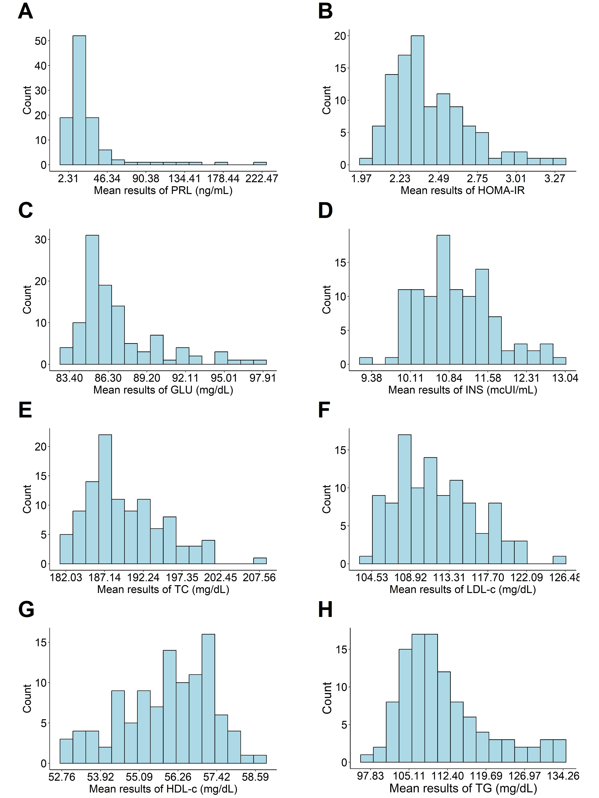

# 1. R Package Installation 

<br>  

```{r Informações,message=FALSE}

################################################################################
################################################################################
##########################  (1) Instalação Pacote R ############################
################################################################################
################################################################################
################################################################################


Pacotes_R <- c("rmarkdown","knitr","multimode","modeest","rstatix","univOutl",
               "readxl","utf8","pwr","forecast","MultNonParam","ggplot2","earth",
               "plotly","DT","kableExtra","dplyr","stats","segmented","caret",
               "refineR","SciViews","rcompanion","effectsize","car","moments",
               "ggpubr","extrafont","jpeg","grid","gridExtra","gtable",
               "writexl","metafor","meta")


if(sum(as.numeric(!Pacotes_R %in% installed.packages())) != 0){
  instalador <- Pacotes_R[!Pacotes_R %in% installed.packages()]
  for(i in 1:length(instalador)) {
    install.packages(instalador, dependencies = TRUE)
    break()}
  sapply(Pacotes_R, require, character = TRUE)
  } else {
    sapply(Pacotes_R, require, character = TRUE)
  }

# Set the path to the folder containing the images
path_to_figures <- "1_Figures/"

# Specific names of the image files you want to load, in the specific order
image_filenames <- sprintf("Fig.%d.jpeg", 1:8)  # This creates "Fig.1.jpg", "Fig.2.jpg", ..., "Fig.7.jpg"

# Full paths to files
image_paths <- file.path(path_to_figures, image_filenames)

# Function to read and convert images into 'grobs' (graphic objects)
image_grobs <- lapply(image_paths, function(image_file) {
    img <- readJPEG(image_file)
    rasterGrob(img, interpolate = TRUE)
})

# Function to add labels to images by adjusting the label position
add_label <- function(grob, label) {
  arrangeGrob(
    grob, 
    top = textGrob(
      label, 
      x = unit(0.06, "npc"),  # Adjust as needed to move the label horizontally
      y = unit(0.6, "npc"),  # Adjust as needed to move the label vertically
      just = "left",
      gp = gpar(fontfamily = "Arial", fontsize = 16, fontface = "bold")
    )
  )
}

# Apply labels to images
labeled_grobs <- mapply(add_label, image_grobs, LETTERS[1:8], SIMPLIFY = FALSE)

# Build the layout with the 'grobs' in the correct order, adjusting the spacing
grid_layout <- gridExtra::grid.arrange(
  grobs = labeled_grobs,
  layout_matrix = rbind(
    c(1, 2),
    c(3, 4),
    c(5, 6),
    c(7, 8)  
  ),
  as.table = TRUE,  # Keeps sizes consistent
  widths = unit(c(1, 1), "null"),  # Adjusted spacing between columns
  heights = unit(c(1, 1, 1, 1), "null"),  # Adjusted spacing between lines
  bottom = unit(2, "lines"),  # Increase space at the bottom
  top = unit(4, "lines")  # Increases space at the top
)

# Set the file path for the compiled image
output_file_path <- file.path(path_to_figures, "combined_image.jpeg")

# Set the resolution
res <- 600  # DPI
width_in_inches <- 6  
height_in_inches <- 8 

# Open JPEG device
jpeg(filename = output_file_path, width = width_in_inches * res, 
     height = height_in_inches * res, res = res)

# Draw layout on device
grid.draw(grid_layout)

# Close the JPEG device (this saves the file)
dev.off()
```


{width="250"}